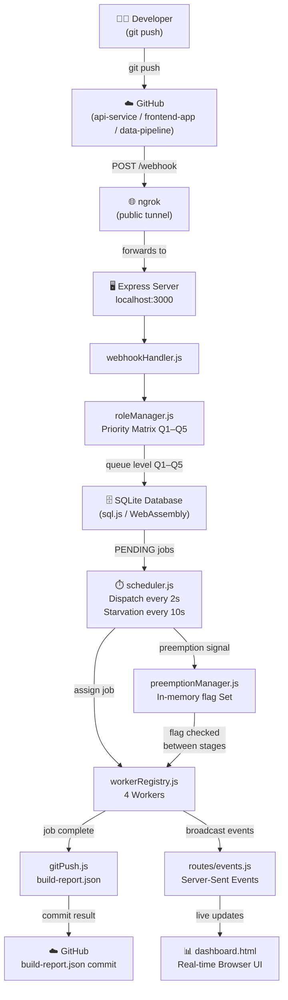
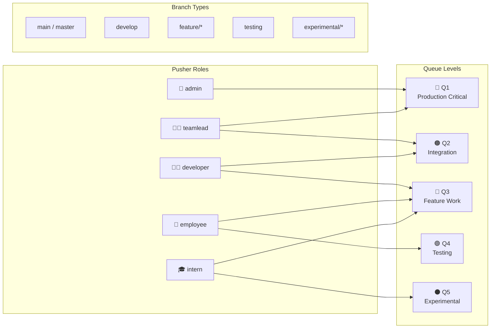
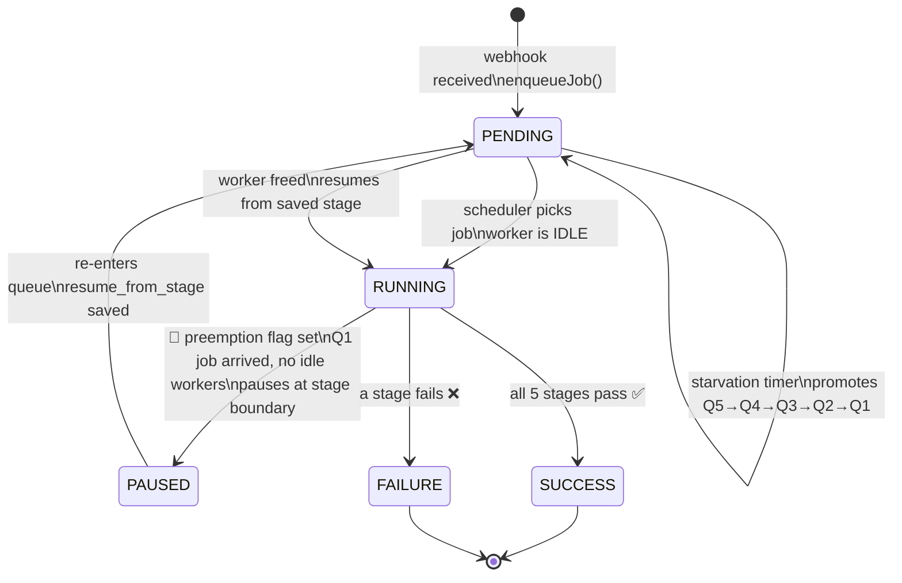
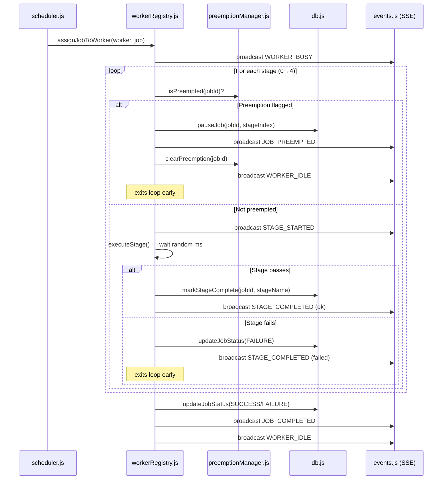
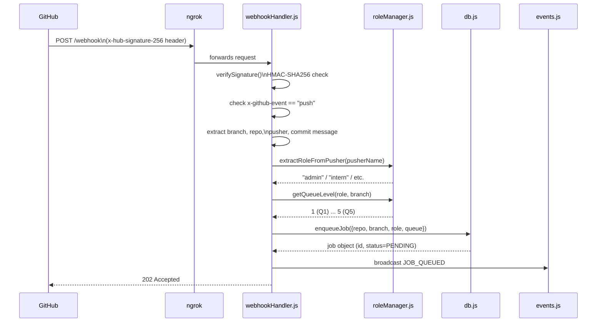
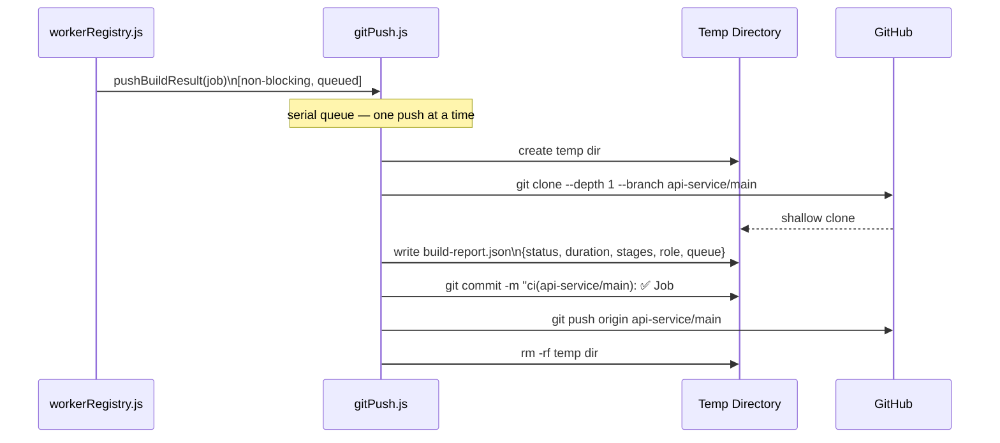
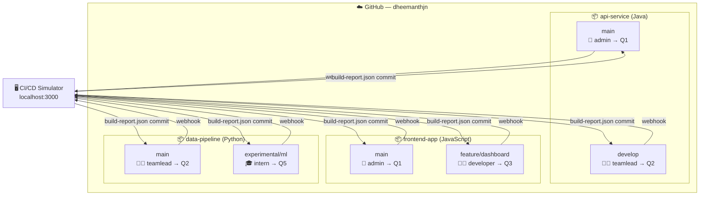
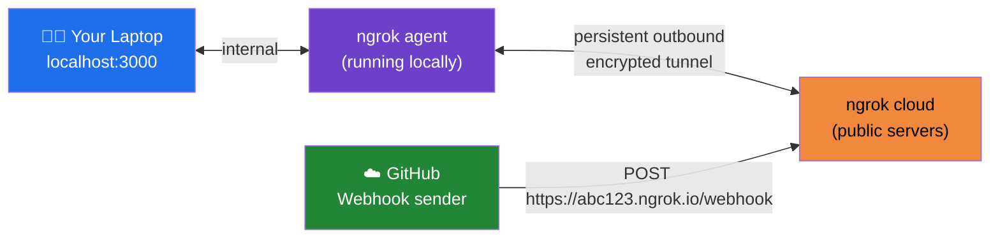
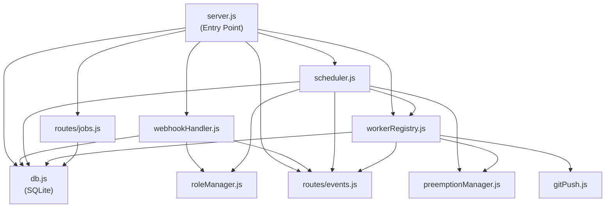

# System Architecture — Jenkins CI/CD Simulator

---

## 1. High-Level Overview



---

## 2. Priority Queue — Role × Branch Matrix



---

## 3. Preemption Flow (State Machine)



---

## 4. Pipeline Stage Execution



---

## 5. Webhook → Job Creation Flow



---

## 6. Starvation Prevention Timer

```mermaid
gantt
    title Starvation Promotion Timeline
    dateFormat ss
    axisFormat %Ss

    section Q5 Job (intern)
    Waiting at Q5          : 0, 120s
    Promoted to Q4         : milestone, 120s, 0s

    section Q4 Job (employee)
    Waiting at Q4          : 0, 240s
    Promoted to Q3         : milestone, 240s, 0s

    section Q3 Job (developer)
    Waiting at Q3          : 0, 420s
    Promoted to Q2         : milestone, 420s, 0s

    section Q2 Job (teamlead)
    Waiting at Q2          : 0, 720s
    Promoted to Q1         : milestone, 720s, 0s
```

---

## 7. Git Push Back — CI Results to GitHub



---

## 8. The 3 Repositories & 6 Branches



---

## 9. ngrok Tunnel Architecture



**Why it works through firewalls:**
- The tunnel is opened **outbound** from your machine (like a browser)
- Firewalls block inbound connections but allow outbound
- GitHub's POST request travels: GitHub → ngrok cloud → reverse through tunnel → your machine

---

## 10. Component Dependency Map



---

*Render this file in VS Code with the **Markdown Preview Mermaid Support** extension, or paste any diagram block into [mermaid.live](https://mermaid.live)*
